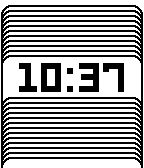
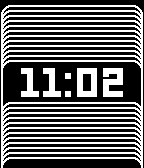
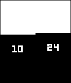
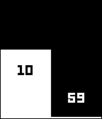
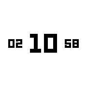
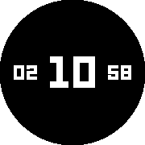
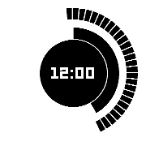

# pebble-watchfaces

| Watchface       | Light Screenshot                                                                       | Dark Screenshot |
|-----------------|:--------------------------------------------------------------------------------:|:---------------------------------------------------------------------------------:|
| stacked         |              |  |
| halfy           |                |  |
| round-mega-mini |      |  |
| analog-minimaly |      |  |
| micro-blacks    |         |  |
| roundy-numbers  |       |  |
| j-mono          |               |  |
| target          |               |  |
| a158            |                 |  |
| pie             |                  |                   |
| randy           |                |  |
